# 🏨 Hotel Booking Cancellation Predictor - Streamlit App

This folder contains a self-contained, interactive implementation of the **Hotel Reservation Cancellation Prediction System**. It serves as a **Proof of Concept (PoC)** demonstrating how the machine learning model can be deployed for real-time business decision-making.

## 🚀 Overview

This application allows hotel revenue managers to input booking details and receive an instant risk assessment. By identifying high-risk bookings before they happen, hotels can implement proactive retention strategies, such as personalized follow-ups or dynamic deposit requirements.

> [!NOTE]
> This app is part of a larger Data Science portfolio project. The full analysis, including model training, feature engineering, and business impact simulation, can be found in the [root of the repository](..).

## 🛠️ Data Workflow

The following diagram illustrates how the application utilizes the project's data and pre-trained model to generate predictions:

```mermaid
graph TD
    User["👤 User Input"] -->|Booking Details| App["💻 Streamlit App (app.py)"]
    
    subgraph Assets ["📁 Pre-trained Assets"]
        Model["🧠 voting_classifier_pipeline_model.pkl"]
        Features["📋 feature_names.pkl"]
    end
    
    subgraph Data ["📁 Datasets"]
        CSV["📄 Hotel Reservations.csv"]
    end
    
    App -->|Loads| Assets
    App -.->|Reference| Data
    
    App -->|Validates| CleanData["✨ Validated Data"]
    CleanData -->|Pipeline Transform| Preprocessor["⚙️ Preprocessing (Scaling + PCA)"]
    Preprocessor -->|Predicts| Predictor["🔮 Ensemble Model (RF + XGB + CatBoost)"]
    Predictor -->|Soft Voting| Probabilities["📈 Risk Probabilities"]
    Probabilities -->|Threshold Check| Result["✅ Final Prediction (Low/High Risk)"]
    
    Result -->|Displays| User
```



### Component Details
- **`app.py`**: The core application logic, handling the UI, input validation, and model inference.
- **`models/voting_classifier_pipeline_model.pkl`**: A serialized Scikit-Learn pipeline containing the complete preprocessing (RobustScaler, targeted PCA) and the ensemble Voting Classifier.
- **`datasets/Hotel Reservations.csv`**: Included for reference and to demonstrate the data schema the model was trained on.

## 🏃 Installation & Usage

### Prerequisites
- Python 3.8+
- Recommended: A virtual environment (Conda or venv)

### Quick Start

1. **Install Dependencies**:
   ```bash
   pip install -r requirements.txt
   ```

2. **Run the Application**:
   ```bash
   streamlit run app.py
   ```

3. **Access the App**:
   Open your browser and navigate to `http://localhost:8501`.

## 🧪 Configuration

The risk sensitivity can be adjusted directly in `app.py`:

```python
# Threshold for cancellation risk classification (0.0 to 1.0)
CANCELLATION_RISK_THRESHOLD = 0.6  # Default: 60%
```

Increasing the threshold makes the app more "conservative" (flagging only very high-risk cases), while decreasing it makes it more "sensitive" (catching more potential cancellations but increasing false alarms).

---
**Author:** Sebastián Rolando | MIT License © 2024
