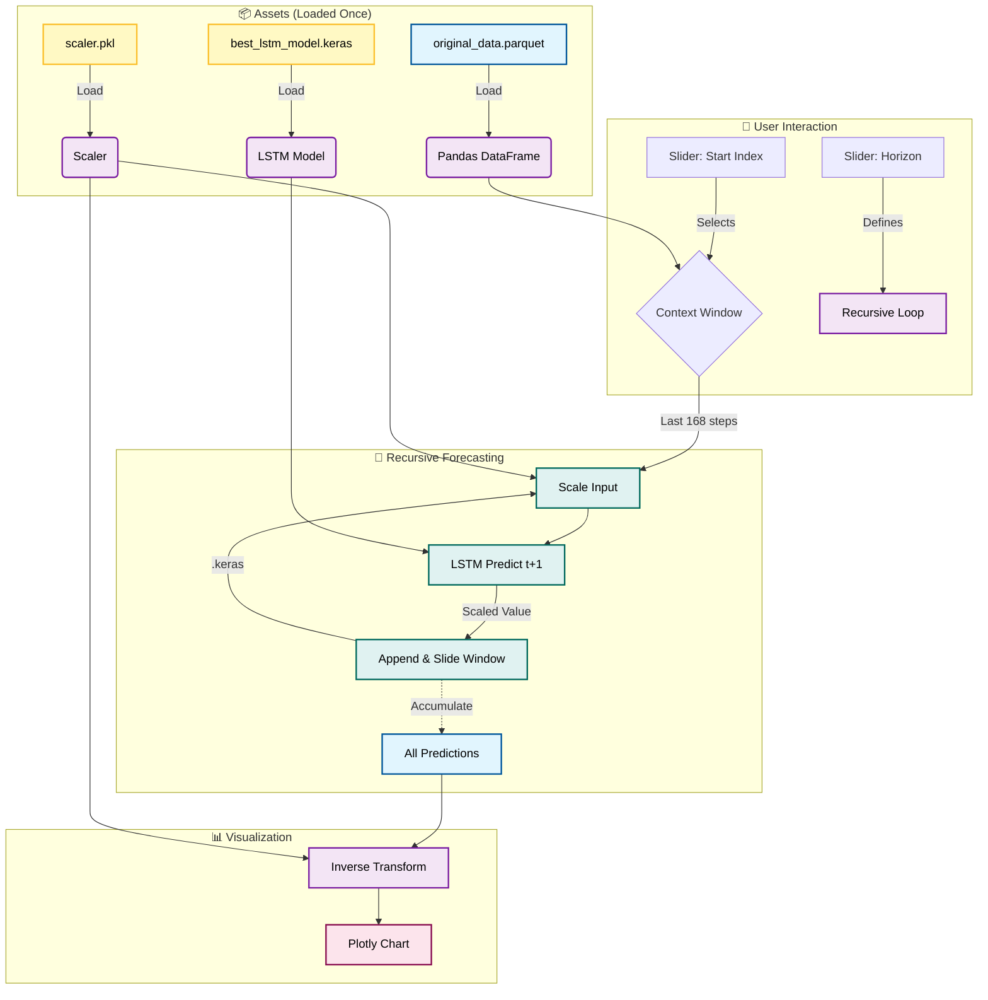

# Strategic Energy Demand Forecasting App


## ⚡ Overview

This **[Live Streamlit App](https://energy-demand-forecasting-lstm.streamlit.app)** serves as a **Business Intelligence & Forecasting Interface** for the **[Energy Demand Forecasting LSTM](https://github.com/rolaseba/energy-demand-forecasting-lstm)** project.

> **🎯 [Click here to Play with the Live App!](https://energy-demand-forecasting-lstm.streamlit.app)**
> *Please explore the tool to experience the forecasting capabilities firsthand, this documentation refers to the deployed version.*

It acts as a "Pattern Continuum Explorer," moving away from traditional date-based plotting to an **index-based analysis** that highlights the temporal rhythms (diurnal and weekly cycles) inherent in energy grid data.

Key capabilities:
- **Interactive Time Machine**: Navigate through historical data time steps.
- **Pattern Overlays**: Visual guides for 24-step (daily) and 168-step (weekly) cycles.
- **Neural Forecasting**: Real-time recursive predictions using a pre-trained LSTM model.
- **Business Insights**: Metrics for cycle position and week-over-week deltas.

---

## 🔗 Connection to Main Repository

This app is the deployment frontend for the core machine learning work found in the [main repository](https://github.com/rolaseba/energy-demand-forecasting-lstm).

- **Core Logic**: The model architecture (3-layer LSTM), training pipeline, and data validation are defined in the main repo's notebooks (`notebook-energy.ipynb`).
- **Artifacts**: The app consumes the *output* of that rigorous training process—specifically the trained model file and processed datasets.

This separation allows:
1.  **Production Readiness**: The app only loads what it needs (artifacts), keeping it lightweight.
2.  **Reproducibility**: The model training is versioned and distinct from the user interface.

---

## 📂 Data Usage & Pipeline

The app relies on **1 pre-processed Parquet file** located in `streamlit_app/data/`. This is generated by the main project's data pipeline.

### 1. `original_data.parquet`
*   **Content**: The complete, cleaned time series of energy demand.
*   **Usage**: Provides the "Ground Truth" for historical visualization and the context window required for the LSTM to make predictions.
    ```python
    # Loading
    original_data = pd.read_parquet(DATA_DIR / 'original_data.parquet')

    # Usage: Get context for prediction
    context_start = start_index - 168
    prediction_context = original_data['demand_mw'].values[context_start:start_index]
    ```

---

## 🧠 Data Science & Model Architecture


The core of this application is a **Long Short-Term Memory (LSTM)** neural network, specifically designed for multi-step time-series forecasting.

### Network Architecture
The model uses a stacked LSTM architecture with progressive dimensionality reduction to capture complex temporal dependencies.

```text
Input Sequence: (Batch Size, 168, 1)  ← 1 Week of History
      ↓
[LSTM Layer 1] 128 Units + Batch Normalization + Return Sequences
      ↓      (Captures high-level temporal features)
[Dropout 0.2]
      ↓
[LSTM Layer 2] 64 Units + Batch Normalization + Return Sequences
      ↓      (Intermediate feature processing)
[Dropout 0.2]
      ↓
[LSTM Layer 3] 32 Units + Batch Normalization
      ↓      (Refinement of temporal signals)
[Dropout 0.2]
      ↓
[Dense Layer] 1 Unit
      ↓
Output: (Batch Size, 1)  ← Next Hour Prediction (t+1)
```

### Key Hyperparameters
*   **Optimizer**: Adam (`lr=0.001`)
*   **Loss Function**: Mean Squared Error (MSE)
*   **Input Window**: 168 hours (1 full week) allows the model to "see" daily cycles and weekly seasonality.
*   **Regularization**: Dropout (0.2) + Batch Normalization after each recurrent layer to prevent overfitting.

### Performance (Test Set)
*   **MAPE (Mean Absolute Percentage Error)**: 3.95%
    *   *Interpretation*: On average, predictions are off by only ~4%. Values below 5% are considered excellent for grid forecasting.
*   **MAE (Mean Absolute Error)**: 320.21 MW
    *   *Interpretation*: The average gap between predicted and actual demand is ~320 MW (on a grid of ~8,000+ MW).
*   **RMSE (Root Mean Square Error)**: 1456.82 MW
    *   *Interpretation*: Penalizes larger errors more heavily. A metric used to detect significant deviations or outliers.

---

## 🔄 Data Workflow



## 🛠️ Technical Implementation

### 1. Robust Path Handling
To ensure the app runs on both local machines and Streamlit Cloud, we use relative path resolution:

```python
from pathlib import Path

# Always resolve relative to the script's location
script_dir = Path(__file__).parent
DATA_DIR = script_dir / '../datasets/processed'
MODEL_DIR = script_dir / '../model'
```

### 2. Streamlit Caching
We use `st.cache_data` and `st.cache_resource` to load heavy assets only once (Singleton pattern):

```python
@st.cache_data
def load_data():
    # Reads parquet files once
    return pd.read_parquet(DATA_DIR / 'original_data.parquet')

@st.cache_resource
def load_model_artifacts():
    # Loads TensorFlow model and Scaler once
    model = load_model(MODEL_DIR / 'best_lstm_model.keras')
    scaler = joblib.load(MODEL_DIR / 'scaler.pkl')
    return model, scaler
```

### 3. Recursive Forecasting Logic
The LSTM model is trained to predict **t+1**. To predict a horizon of **N steps** (e.g., 96 hours), the app implements a recursive loop:

1.  **Input**: Take the last 168 scaled values (context window).
2.  **Predict**: Model generates the *next* single scaled value.
3.  **Update**: Append prediction to the input window, slide window forward by 1.
4.  **Repeat**: Do this N times.
5.  **Inverse Transform**: Convert the array of N scaled predictions back to MW (Megawatts) using the loaded `scaler`.

```python
def predict_future(model, scaler, history_window, horizon=96):
    # logic simplified
    current_input = preprocess(history_window)
    predictions = []
    
    for _ in range(horizon):
        pred = model.predict(current_input)
        predictions.append(pred)
        current_input = update_window(current_input, pred)
        
    return scaler.inverse_transform(predictions)
```

---

## 💻 Run Locally

To run this application on your local machine:

1.  **Navigate to the app directory**:

    ```bash
    cd streamlit_app
    ```

2.  **Install dependencies**:

    ```bash
    pip install -r requirements.txt
    ```

3.  **Launch the App**:

    ```bash
    streamlit run app.py
    ```

---

## 🚀 How to Replicate

To build a similar "Scenario Explorer" for your own time-series models:

1.  **Train your Model**: Save it as `.keras` or `.h5`.
2.  **Save your Scaler**: Save the `sklearn` scaler using `joblib.dump()`.
3.  **Process Data**: Export your clean data to `.parquet` for fast read speeds.
4.  **Structure the App**:
    *   `app.py`: Main UI code.
    *   `requirements.txt`: Dependencies (streamlit, plotting, tensorflow-cpu).
5.  **Deploy**: Push to GitHub and connect to [Streamlit Cloud](https://streamlit.io/cloud).

### Dependencies
Defined in `requirements.txt`:
- `streamlit`
- `pandas`, `numpy`
- `plotly` (Interactivity)
- `scikit-learn` (Scaling)
- `tensorflow-cpu` (Inference)
- `pyarrow` (Parquet engine)

---

**Author**: [Sebastián Rolando](https://github.com/rolaseba)  
Part of the [Energy Demand Forecasting Portfolio](https://github.com/rolaseba/energy-demand-forecasting-lstm).
